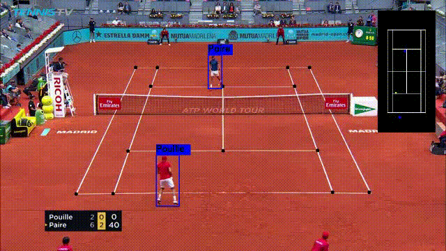

# Tennis-Insight-system
Tennis analysis using deep learning and machine learning.

## How to run
Prepare a video file with resolution 1280x720
1. Clone the repository 
2. Run `pip install -r requirements.txt` to install packages required
3. Run follwing command:
    """bash/powershell
        python main.py --path_ball_track_model "./models/ball_track_model.pt" --path_court_model "./models/court_detect_model.pt" --path_bounce_model "./models/bounce_detect_model.cbm" --path_input_video "./videos/origin_720p.mp4" --path_output_video "./videos/output_720p.avi"
    """

### Where is the demo video?

- Go to ./videos to find the demo.
   

